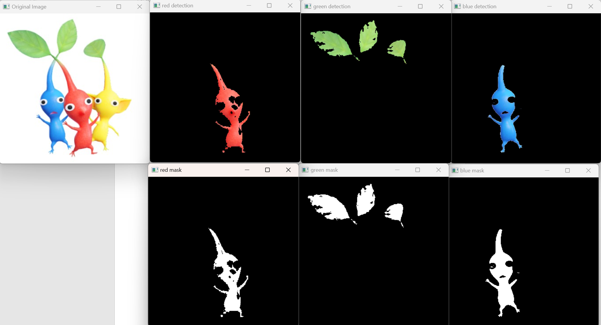

# Object Color Classifier with OpenCV
### Classifies objects based on their color using OpenCV

This project provides a cool way to classify and detect objects based on their color using just OpenCV and Python.

The project is inspired by color-based object detection techniques and aims to identify and classify objects in an image based on specific color ranges.

## **Key Points**
1. **Steps involved:**
    1. Load the image.
    2. Define color ranges for different objects (e.g., red, green, blue).
    3. Detect the color in the image using OpenCV.
    4. Apply the mask to detect objects of the selected color.
    5. Display the detected objects with bounding boxes or separate the mask and result.
    
2. **Assumptions:**
    1. The object colors are distinguishable in the image based on predefined color ranges.
    2. The object can be detected based on its distinct color.

3. **The process uses color detection techniques:**
    1. Convert the image to HSV color space for easier color detection.
    2. Use OpenCV's `inRange()` function to create a mask for detecting objects within the color range.
    3. Apply the mask to the original image to identify and isolate the objects of interest.

## **Requirements** (with versions I tested on):
1. python (3.7.3)
2. opencv-python (4.1.0)
3. numpy (1.61.4)
4. imutils (0.5.2)

## **Commands to run the detection:**
You can run the `main.py` to process images and detect objects based on their color:

## **Demonstration**

Here is a demonstration of the object detection results:

## Resources

Here are the resources and references used to create this project:

- **OpenCV Documentation**: [https://docs.opencv.org/](https://docs.opencv.org/)
- **OpenCV Tutorials**: [https://docs.opencv.org/master/d9/df8/tutorial_root.html](https://docs.opencv.org/master/d9/df8/tutorial_root.html)
- **Python Official Documentation**: [https://docs.python.org/3/](https://docs.python.org/3/)
- **HSV Color Range Guide**: [https://alloyui.com/color-picker/](https://alloyui.com/color-picker/)
  

